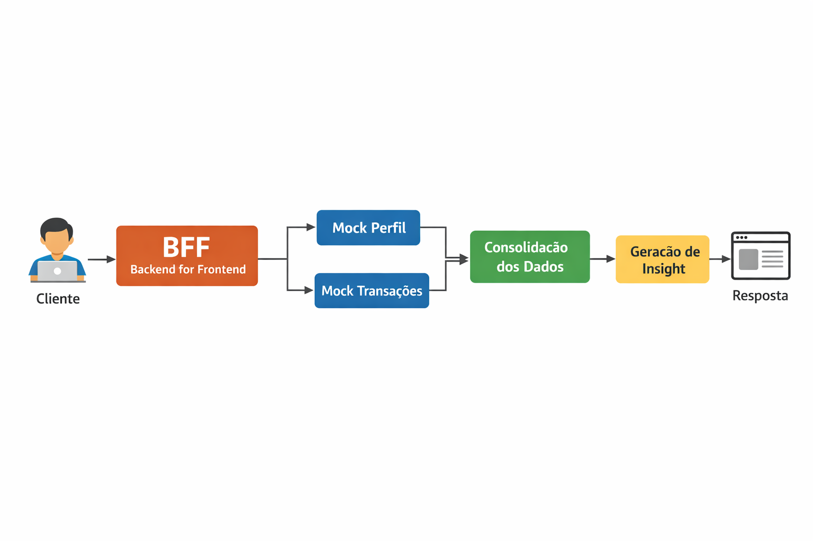

Itaú BFF – Insights com IA (Mock)

Este projeto implementa um **Backend for Frontend (BFF)** em Go, responsável por consolidar dados de múltiplos serviços e entregar um insight único para o front-end.

A aplicação foi desenvolvida com foco em:
- simplicidade
- organização de código
- comportamento real de produção
- facilidade de execução local

---

🎯 Objetivo

O BFF expõe um endpoint que:
1. Busca dados do perfil do cliente
2. Busca transações recentes
3. Consolida essas informações
4. Gera um texto de insight (simulado)
5. Retorna uma resposta única e simples para o front-end

Nenhum serviço externo real é utilizado. Todos os serviços são **mockados localmente**, conforme solicitado.

---

 🔗 Endpoint principal

 `GET /v1/insights/{customerId}`

Exemplo de chamada:

```bash
curl http://localhost:8080/v1/insights/abc123

Resposta de sucesso

{
  "customerId": "abc123",
  "insight": "Cliente Cliente Exemplo realizou 5 transações recentemente, totalizando 1234.56.",
  "meta": {
    "cached": false
  }
}

🧠 Principais decisões do projeto

Orquestração em paralelo

As chamadas para perfil e transações acontecem ao mesmo tempo, reduzindo o tempo total de resposta.

Timeout e cancelamento

O BFF possui um tempo máximo de espera. Caso algum serviço demore demais, a requisição é encerrada de forma segura.

Cache em memória

Os resultados são armazenados por 60 segundos, evitando chamadas repetidas para o mesmo cliente.
A resposta indica quando o dado veio do cache.

Resiliência

Retry automático para falhas temporárias
Circuit breaker para evitar sobrecarregar serviços instáveis
Limitação de concorrência (bulkhead)

Observabilidade

Logs estruturados
Métricas com Prometheus
Tracing simples com OpenTelemetry

🧪 Testes

O projeto possui:

Testes unitários
Service
Handlers

Testes de integração
Fluxo completo do endpoint
Casos de sucesso e timeout

Para rodar todos os testes:

go test ./... -v

Os testes garantem que o comportamento da aplicação seja previsível mesmo em cenários de falha.

📊 Observabilidade

Logs

Os logs exibem:
status da requisição
tempo de resposta
indicação de uso de cache

Métricas

Disponíveis em:

GET /metrics

Tracing

Tracing simples foi implementado para:
handler
service
clients

Os spans permitem visualizar claramente o fluxo da requisição.

🐳 Rodando com Docker Compose

É possível rodar o projeto sem instalar Go localmente, utilizando Docker Compose.

Subir a aplicação:

docker compose up --build

A API ficará disponível em:

http://localhost:8080

Parar a aplicação:

docker compose down

🏗️ Arquitetura da solução

A arquitetura segue o padrão Backend for Frontend (BFF).

Fluxo geral:

O cliente chama o BFF
O BFF busca perfil e transações em paralelo
Os dados são consolidados
Um insight é gerado (mock)
A resposta é devolvida ao front-end

❤️ Organização do projeto

cmd/
 └── api/
     └── main.go

internal/
 ├── cache/
 ├── clients/
 ├── http/
 │   └── handlers/
 ├── service/
 ├── observability/
 └── integration/

A separação segue responsabilidades claras, facilitando manutenção e evolução do projeto.

